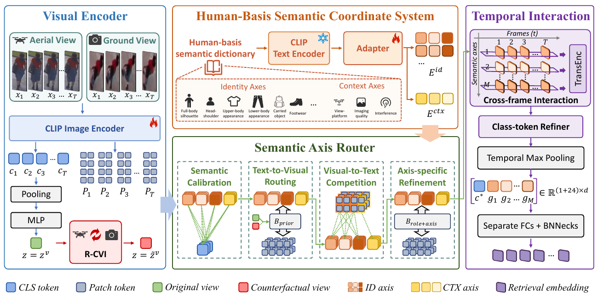

# SAR-ReID

**Semantic-Axis Routing for Aerial-Ground Video Person Re-Identification**

[简体中文](README_zh-CN.md) · [Reproducibility notes](docs/REPRODUCIBILITY.md) · [Publishing checklist](docs/PUBLISHING_CHECKLIST.md)

This repository contains the OpenGait extension for **STAR-CVI**, a
language-guided framework that replaces fixed spatial correspondence with a
Human-Basis semantic coordinate system. Frame-level CLIP patches are routed to
24 identity-retrieval axes and 3 observation-context axes, aggregated as
semantic trajectories, and regularized by router-level counterfactual view
intervention (R-CVI).

> Release status: research code accompanying a manuscript under review. The
> repository is organized as an additive OpenGait extension; datasets and
> checkpoints are not redistributed.



## Highlights

- **Semantic-axis correspondence:** language-defined axes gather the same kind
  of evidence even when its image location changes across frames and platforms.
- **Joint identity-context routing:** a view-conditioned router separates
  identity-relevant evidence from platform, imaging-quality, and scene context.
- **Semantic temporal interaction:** ordered axis trajectories are modeled over
  time before masked pooling.
- **R-CVI:** only the latent view condition used by the router is replaced,
  while visual tokens, semantic prototypes, and network parameters are shared.

## Reported results

Results below are copied from the accompanying manuscript and have not been
re-run as part of this packaging pass.

| AG-VPReID protocol | Rank-1 | Rank-5 | mAP |
| --- | ---: | ---: | ---: |
| Aerial → Ground | 75.8 | 83.8 | 66.7 |
| Ground → Aerial | 78.9 | 88.4 | 62.8 |
| Ground ↔ Ground | 90.1 | 95.4 | 74.4 |
| Aerial ↔ Aerial | 91.7 | 96.2 | 75.7 |

## Repository layout

```text
STAR-CVI/
├── configs/
│   ├── star_cvi_ag_vpreid.yaml
│   └── baselines/deepgaitv2_ag_vpreid.yaml
├── opengait/
│   ├── data/star_cvi_transform.py
│   ├── evaluation/star_cvi_evaluator.py
│   └── modeling/
│       ├── losses/star_cvi_losses.py
│       ├── model_clip/
│       └── models/{star_cvi.py,star_cvi_texts.py}
├── scripts/
│   ├── install_into_opengait.sh
│   ├── prepare_ag_vpreid.py
│   └── validate_repo.py
├── optional_overrides/losses/
├── tests/
└── third_party/
```

## Installation

### 1. Create the environment

Install a CUDA-compatible PyTorch and torchvision build first, following the
[official PyTorch selector](https://pytorch.org/get-started/locally/). Then
install the remaining dependencies:

```bash
python -m pip install -r requirements.txt
```

OpenGait documents PyTorch 1.10 or later. A modern PyTorch 2.x environment is
recommended when the local CUDA stack supports it.

### 2. Prepare OpenGait

The release layout was checked against OpenGait commit
`0efafd4779f127fbce34f22aff301bd82e923da5` (2026-07-16):

```bash
git clone https://github.com/ShiqiYu/OpenGait.git
git -C OpenGait checkout 0efafd4779f127fbce34f22aff301bd82e923da5
bash scripts/install_into_opengait.sh ./OpenGait
```

The installer adds STAR-CVI files and configs; it does not replace OpenGait
core files. If updating a previous STAR-CVI installation, review local changes
and pass `--force` explicitly.

### 3. Prepare AG-VPReID

Obtain AG-VPReID from its
[official repository](https://github.com/agvpreid25/AG-VPReID) and comply with
its access terms. Convert frame folders into OpenGait pickle sequences:

```bash
python scripts/prepare_ag_vpreid.py \
  --train-root /path/to/AG-VPReID/train \
  --test-root /path/to/AG-VPReID/test \
  --output-root ./data/AG-VPReID_OpenGait_PKL_192_96 \
  --partition-out ./datasets/AG-VPReID/AG_VPReID.json
```

See [the dataset preparation guide](datasets/AG-VPReID/README.md) for the
expected layout. Then update these fields in
`OpenGait/configs/star_cvi_ag_vpreid.yaml`:

1. `data_cfg.dataset_root`
2. `data_cfg.dataset_partition`
3. `model_cfg.SeparateBNNecks.class_num` if the converter reports a training-ID
   count different from 1606

The official protocol maps `C0`-`C3` to ground cameras and `C4`-`C5` to UAV
cameras. These values are explicit in `evaluator_cfg` and can be changed for a
different local naming convention.

### 4. CLIP initialization

On first use, the code downloads the official CLIP ViT-B/16 checkpoint to the
standard CLIP cache. For an offline machine, place `ViT-B-16.pt` at:

```text
OpenGait/opengait/modeling/model_clip/ViT-B-16.pt
```

Model weights (`*.pt`, `*.pth`, and checkpoints) are intentionally excluded
from Git.

## Training and evaluation

Run commands from the **OpenGait root**. The released config targets one visible
GPU; for multi-GPU evaluation, also set `evaluator_cfg.sampler.batch_size` to
the number of launched processes, as required by OpenGait.

```bash
cd OpenGait

CUDA_VISIBLE_DEVICES=0 torchrun --standalone --nproc_per_node=1 \
  opengait/main.py --cfgs ./configs/star_cvi_ag_vpreid.yaml --phase train

CUDA_VISIBLE_DEVICES=0 torchrun --standalone --nproc_per_node=1 \
  opengait/main.py --cfgs ./configs/star_cvi_ag_vpreid.yaml \
  --phase test --iter 40000
```

The release schedule uses 40k iterations, AdamW with a base learning rate of
`1e-5`, milestones at 15k and 30k, 4 identities × 4 tracklets, and 10 ordered
frames per tracklet. Image-encoder, prompt, and newly introduced modules use
`1×`, `2×`, and `3×` learning-rate groups, respectively.

## Static validation

GPU-free release checks cover Python syntax, YAML consistency, the semantic
dictionary, CLIP tokenizer resources, private path leakage, and README links:

```bash
python scripts/validate_repo.py
pytest -q
```

Full numerical reproduction additionally requires the licensed dataset, a
working CUDA/PyTorch stack, and the complete training schedule.

## Baseline and optional overrides

- `configs/baselines/deepgaitv2_ag_vpreid.yaml` preserves the RGB AG-VPReID
  baseline settings supplied with the project. The stock OpenGait DeepGaitV2
  implementation is silhouette-oriented and may require the authors' local RGB
  adaptation for 192×96 inputs; this config is therefore provided as a
  reference rather than claimed as a stock-upstream runnable baseline.
- `optional_overrides/losses/` preserves the supplied CE and Triplet variants.
  They are not installed by default because upstream OpenGait already provides
  functionally compatible losses.

## Citation

Author and venue metadata are intentionally provisional while the manuscript
is under review. Update [CITATION.cff](CITATION.cff) before an archival release.

```bibtex
@article{starcvi2026,
  title   = {STAR-CVI: Semantic-Axis Routing with Counterfactual View Intervention for Aerial-Ground Video Person Re-Identification},
  author  = {{STAR-CVI Authors}},
  year    = {2026},
  note    = {Manuscript under review}
}
```

## Acknowledgements and license

This implementation builds on
[OpenGait](https://github.com/ShiqiYu/OpenGait) and includes modified components
from [OpenAI CLIP](https://github.com/openai/CLIP). See
[THIRD_PARTY_NOTICES.md](THIRD_PARTY_NOTICES.md) and the bundled upstream
license text.

No public license has yet been selected for the original STAR-CVI code; see
[LICENSE](LICENSE). The authors should select explicit release terms before
making the repository public.
